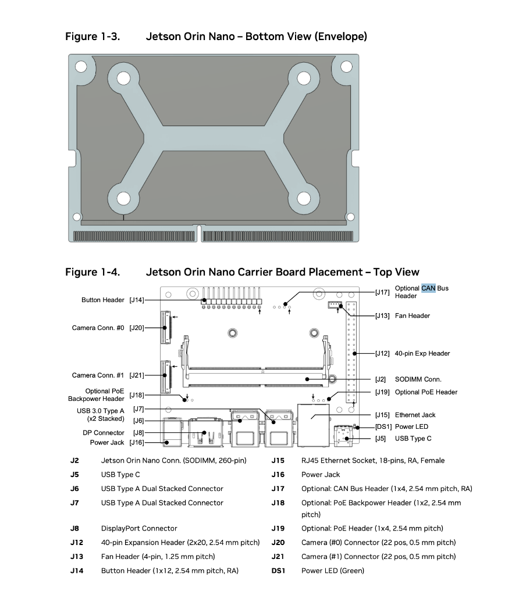
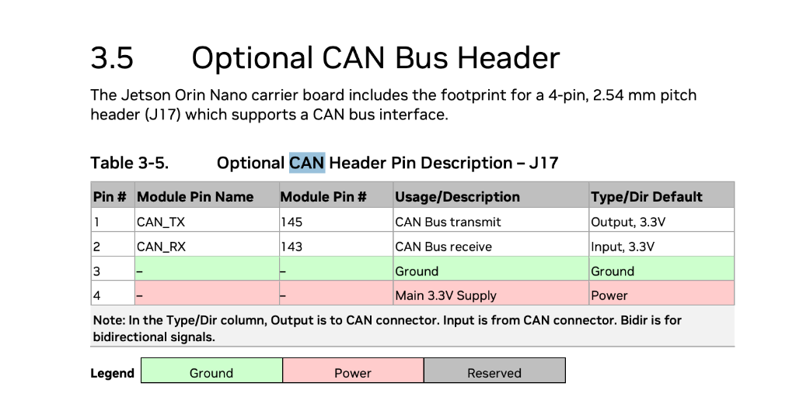

# Jetson Orin Nano Super - Native CAN Setup Guide

## Overview

Use the **built-in CAN controller** on Jetson Orin Nano Super for direct motor control. No USB adapters needed - just connect a CAN transceiver to the J17 header!

**Advantages:**
- ✅ Lower latency (no USB overhead)
- ✅ More reliable (native hardware)
- ✅ Higher bandwidth
- ✅ One less cable/device
- ✅ Standard Linux SocketCAN interface

---

## Hardware Setup

### 1. J17 CAN Bus Header Pinout





**J17 Header (4-pin, 2.54mm pitch):**

| Pin | Signal | Module Pin | Description | Type |
|-----|--------|------------|-------------|------|
| **1** | **CAN_TX** | 145 | CAN Bus Transmit | Output, 3.3V |
| **2** | **CAN_RX** | 143 | CAN Bus Receive | Input, 3.3V |
| **3** | **GND** | - | Ground | Ground |
| **4** | **3.3V** | - | Main 3.3V Supply | Power |

### 2. SN65HVD230 Transceiver Wiring

```
Jetson J17 Header          SN65HVD230 Module       Motors
──────────────────         ─────────────────       ──────
Pin 1 (CAN_TX)       →     CTX (TX input)
Pin 2 (CAN_RX)       ←     CRX (RX output)
Pin 4 (3.3V)         →     3V3
Pin 3 (GND)          →     GND
                           CANH              →     Yellow to all motors
                           CANL              →     Green to all motors

Motor Power Supply:
GND                  →     Motor GND (common ground!)
```

**⚠️ Important:**
1. **Use 3.3V only** for SN65HVD230 (Pin 4 on J17)
2. Add **120Ω termination resistor** between CANH and CANL at **both ends** of bus
3. Common ground between Jetson, transceiver, and motors

---

## Software Setup

### Step 1: Enable CAN in Device Tree

The Jetson Orin Nano Super has CAN support, but it needs to be enabled via device tree.

#### Option A: Using Jetson IO Tool (Easiest)

```bash
# Run Jetson-IO configuration tool
sudo /opt/nvidia/jetson-io/jetson-io.py

# Navigate to:
#   Configure Jetson 40pin Header → Configure header pins manually
#   Find CAN0 and enable it (ensure 1Mbps if configurable)
#   Save and exit
#   Reboot when prompted

sudo reboot
```

#### Option B: Manual Device Tree Overlay

Create `/boot/dtb/kernel_tegra234-p3768-0000+p3767-0005-nv.dtb.dts` overlay:

```dts
/dts-v1/;
/plugin/;

/ {
    overlay-name = "Enable CAN0";
    compatible = "nvidia,p3768-0000+p3767-0005";

    fragment@0 {
        target-path = "/";
        __overlay__ {
            mttcan@c310000 {
                status = "okay";
            };
        };
    };
};
```

Compile and apply:
```bash
sudo dtc -I dts -O dtb -o /boot/can0-overlay.dtbo can0-overlay.dts
# Add to /boot/extlinux/extlinux.conf
sudo reboot
```

### Step 2: Install CAN Utilities

```bash
# Install can-utils for testing
sudo apt-get update
sudo apt-get install -y can-utils

# Install Python CAN library
pip3 install python-can
```

### Step 3: Configure CAN Interface

```bash
# Bring up CAN0 at 1 Mbps (standard for Motorevo motors)
sudo ip link set can0 type can bitrate 1000000
sudo ip link set can0 up

# Verify interface is up
ip -details link show can0
```

**Make it persistent (optional):**

Create `/etc/systemd/network/80-can.network`:
```ini
[Match]
Name=can0

[CAN]
BitRate=1000000
RestartSec=100ms
```

Enable:
```bash
sudo systemctl enable systemd-networkd
sudo systemctl start systemd-networkd
```

### Step 4: Test CAN Interface

```bash
# Terminal 1: Monitor CAN bus
candump can0

# Terminal 2: Send test frame
cansend can0 123#DEADBEEF

# You should see the message in Terminal 1!
```

---

## Python Integration

### Install Dependencies

```bash
pip3 install python-can
```

### Updated Motor Controller (SocketCAN)

Create `bipedCANController/can_native_controller.py`:

```python
"""
Native CAN motor controller using SocketCAN interface.
Direct CAN communication without USB adapters.
"""

import can
import time
import threading
from utils import float_to_uint, uint_to_float

class Motor:
    """Motor object for SocketCAN"""
    def __init__(self, name, motor_id, type_name="REVO"):
        self.name = name
        self.id = motor_id
        self.type_name = type_name
        
        # State
        self.pos = 0.0
        self.vel = 0.0
        self.torque = 0.0
        self.temperature = 0
        self.status_words = 0

class CANMotorController:
    """Motor controller using Linux SocketCAN"""
    
    def __init__(self, channel='can0', bitrate=1000000):
        self.channel = channel
        self.bitrate = bitrate
        self.motors = {}
        
        # Initialize CAN bus
        try:
            self.bus = can.Bus(channel=channel, interface='socketcan', bitrate=bitrate)
            print(f"✓ CAN interface {channel} opened at {bitrate} bps")
        except Exception as e:
            print(f"✗ Failed to open CAN {channel}: {e}")
            raise
        
        # Background receiver thread
        self.running = False
        self.rx_thread = None
    
    def add_motor(self, motor):
        """Add motor to controller"""
        self.motors[motor.id] = motor
    
    def start(self):
        """Start background receiver thread"""
        self.running = True
        self.rx_thread = threading.Thread(target=self._receive_loop, daemon=True)
        self.rx_thread.start()
    
    def stop(self):
        """Stop receiver thread and close bus"""
        self.running = False
        if self.rx_thread:
            self.rx_thread.join(timeout=1.0)
        self.bus.shutdown()
    
    def _receive_loop(self):
        """Background thread to receive CAN messages"""
        while self.running:
            try:
                msg = self.bus.recv(timeout=0.01)
                if msg and msg.arbitration_id in self.motors:
                    self._process_feedback(msg)
            except Exception as e:
                print(f"RX error: {e}")
    
    def _process_feedback(self, msg):
        """Parse CAN message and update motor state"""
        motor = self.motors.get(msg.arbitration_id)
        if not motor or len(msg.data) < 8:
            return
        
        # Parse feedback (same format as USB version)
        data = msg.data
        motor.status_words = data[0]
        motor.pos = uint_to_float(int.from_bytes(data[1:3], 'little'), -12.5, 12.5, 16)
        motor.vel = uint_to_float(int.from_bytes(data[3:5], 'little'), -30, 30, 16)
        motor.torque = uint_to_float(int.from_bytes(data[5:7], 'little'), -12, 12, 16)
        motor.temperature = data[7]
    
    def motor_mode(self, motor):
        """Enable motor mode (0xFC command)"""
        data = [0xFF, 0xFF, 0xFF, 0xFF, 0xFF, 0xFF, 0xFF, 0xFC]
        msg = can.Message(arbitration_id=motor.id, data=data, is_extended_id=False)
        self.bus.send(msg)
    
    def reset_mode(self, motor):
        """Reset motor (0xFD command)"""
        data = [0xFF, 0xFF, 0xFF, 0xFF, 0xFF, 0xFF, 0xFF, 0xFD]
        msg = can.Message(arbitration_id=motor.id, data=data, is_extended_id=False)
        self.bus.send(msg)
    
    def PTM_control(self, motor, pos, vel, kp, kd, torque):
        """Send PTM control command"""
        pos_uint = float_to_uint(pos, -12.5, 12.5, 16)
        vel_uint = float_to_uint(vel, -30, 30, 16)
        kp_uint = float_to_uint(kp, 0, 500, 16)
        kd_uint = float_to_uint(kd, 0, 5, 16)
        torque_uint = float_to_uint(torque, -12, 12, 16)
        
        data = [
            pos_uint & 0xFF, (pos_uint >> 8) & 0xFF,
            vel_uint & 0xFF, (vel_uint >> 8) & 0xFF,
            kp_uint & 0xFF, (kp_uint >> 8) & 0xFF,
            kd_uint & 0xFF, (kd_uint >> 8) & 0xFF
        ]
        
        msg = can.Message(arbitration_id=motor.id, data=data, is_extended_id=False)
        self.bus.send(msg)
```

### Example Usage

```python
from can_native_controller import CANMotorController, Motor

# Create controller
controller = CANMotorController(channel='can0', bitrate=1000000)

# Add motor
motor = Motor("hip_motor", motor_id=3, type_name="REVO")
controller.add_motor(motor)

# Start receiver thread
controller.start()

# Enable motor
controller.motor_mode(motor)
time.sleep(0.1)

# Send PTM command
controller.PTM_control(motor, pos=0.5, vel=0.0, kp=50, kd=1.0, torque=0.0)

# Read feedback
print(f"Position: {motor.pos:.3f} rad")
print(f"Velocity: {motor.vel:.3f} rad/s")
print(f"Torque: {motor.torque:.3f} Nm")
print(f"Temp: {motor.temperature}°C")

# Cleanup
controller.stop()
```

---

## Testing

### 1. Hardware Test

```bash
# Monitor CAN bus
candump can0

# In another terminal, power on motors and check for feedback
# You should see messages from motor IDs (e.g., 003, 004, etc.)
```

### 2. Python Test

```python
import can
import time

# Create bus
bus = can.Bus(channel='can0', interface='socketcan')

# Send motor mode to ID 3
msg = can.Message(arbitration_id=3, data=[0xFF]*7 + [0xFC], is_extended_id=False)
bus.send(msg)

# Wait for response
msg = bus.recv(timeout=1.0)
if msg:
    print(f"Received from ID {msg.arbitration_id}: {msg.data.hex()}")

bus.shutdown()
```

---

## Troubleshooting

### CAN interface not found

```bash
# Check if device tree is loaded
ls /proc/device-tree/mttcan@c310000/

# If not found, re-run jetson-io or verify device tree overlay
```

### Permission denied

```bash
# Add user to can group
sudo usermod -a -G can $USER
# Or run with sudo temporarily
sudo ip link set can0 up
```

### No messages received

1. **Check wiring**: Verify CTX/CRX are not swapped
2. **Check termination**: 120Ω resistors at both ends
3. **Check motor power**: Motors must be powered on
4. **Check bitrate**: Must match motor settings (1Mbps for Motorevo)

### Bus errors

```bash
# Check for errors
ip -details -statistics link show can0

# Reset interface
sudo ip link set can0 down
sudo ip link set can0 up
```

---

## Migration from USB (Jason Module)

**Minimal code changes needed!**

1. Replace `can_motor_controller.py` import with `can_native_controller.py`
2. Update initialization:
   ```python
   # Old (USB):
   controller = MotorController(serial_device)
   
   # New (Native CAN):
   controller = CANMotorController(channel='can0')
   ```
3. Start receiver:
   ```python
   controller.start()  # Replaces polling thread
   ```

All motor control methods (`motor_mode`, `PTM_control`, etc.) work the same!

---

## Performance Benefits

| Metric | USB (Jason) | Native CAN |
|--------|-------------|------------|
| Latency | ~2-5 ms | **~0.5 ms** |
| Bandwidth | Limited by USB | **Full CAN bandwidth** |
| CPU Usage | Higher (USB stack) | **Lower (kernel driver)** |
| Reliability | USB cable issues | **Direct hardware** |

---

## Next Steps

1. ✅ Connect SN65HVD230 to J17 header
2. ✅ Enable CAN in device tree (jetson-io)
3. ✅ Install python-can library
4. ✅ Test with `candump` and `cansend`
5. ✅ Run Python test script
6. ✅ Integrate with main biped controller

You're now ready for native CAN control! 🚀
