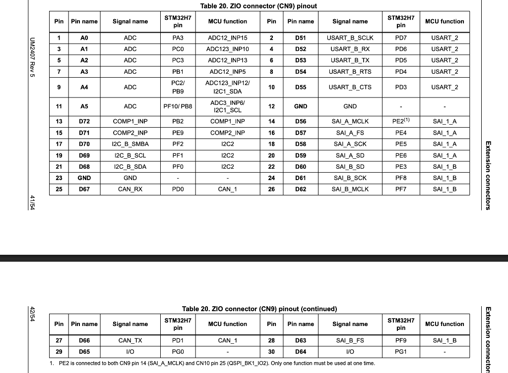

# Nucleo H723ZG - USB-CAN Bridge Setup Guide

## Overview

Use the **Nucleo H723ZG** board as a reliable USB-to-CAN bridge for controlling Motorevo motors. This approach gives you full control over the CAN communication and is much more reliable than commercial USB-CAN adapters.

## Hardware Setup

### 1. Nucleo H723ZG CAN Pins (ZIO Connector CN9)

Based on your board pinout:

| ZIO Pin | Pin Name | Signal | STM32 Pin | Function |
|---------|----------|--------|-----------|----------|
| **25** | **D67** | **CAN_RX** | **PD0** | CAN1_RX |
| **27** | **D66** | **CAN_TX** | **PD1** | CAN1_TX |
| 12 or 23 | GND | GND | - | Ground |



### 2. CAN Transceiver Connection

You need a CAN transceiver module (TJA1050, MCP2551, or SN65HVD230):

```
Nucleo H723ZG (CN9)     CAN Transceiver        Motors
───────────────────     ───────────────        ──────
Pin 27 (D66/PD1)   →    TXD (Pin 1)
Pin 25 (D67/PD0)   ←    RXD (Pin 4)
3.3V or 5V*        →    VCC (Pin 3)
Pin 12/23 (GND)    →    GND (Pin 2)
                        CANH (Pin 7)      →    Yellow to all motors
                        CANL (Pin 6)      →    Green to all motors
                        GND               →    Motor GND

* Use 5V for TJA1050/MCP2551, or 3.3V for SN65HVD230
```

**Important**: Add **120Ω termination resistors** between CANH and CANL at both ends of the bus!

### 3. Power Connections

- **Nucleo**: Powered via USB (from Jetson)
- **Motors**: Separate power supply (as usual)
- **CAN Transceiver**: Powered from Nucleo (3.3V or 5V depending on chip)

---

## Firmware Setup (STM32CubeMX)

### Step 1: Create New Project

1. Open **STM32CubeMX**
2. Select **NUCLEO-H723ZG** board
3. Click **Start Project**

### Step 2: Configure Peripherals

#### USB Configuration
1. **Connectivity** → **USB_OTG_FS**
   - Mode: **Device Only**
   - Activate: ✓

2. **Middleware** → **USB_DEVICE**
   - Class: **Communication Device Class (Virtual Port COM)**

#### CAN Configuration
1. **Connectivity** → **FDCAN1**
   - Mode: **Activate**
   - Bit Timing Parameters:
     - Nominal Prescaler: **10**
     - Nominal Time Seg1: **13**
     - Nominal Time Seg2: **2**
     - Nominal Sync Jump Width: **1**
   - This gives **500 kbps** @ 80 MHz

#### GPIO for CAN (Auto-configured)
- **PD0**: FDCAN1_RX
- **PD1**: FDCAN1_TX
- Both should be set to **Alternate Function** automatically

### Step 3: Clock Configuration

1. Go to **Clock Configuration** tab
2. Set **HCLK** to **550 MHz** (max for H723ZG)
3. Set **APB1** to **137.5 MHz**
4. USB will use **48 MHz** from PLL48

### Step 4: Project Settings

1. **Project** → **Settings**
2. **Project Name**: `nucleo_can_bridge`
3. **Toolchain**: STM32CubeIDE or Keil
4. Generate Code

---

## Firmware Code

### main.c

```c
/* USER CODE BEGIN Includes */
#include "usbd_cdc_if.h"
#include <string.h>
/* USER CODE END Includes */

/* USER CODE BEGIN PV */
FDCAN_TxHeaderTypeDef TxHeader;
FDCAN_RxHeaderTypeDef RxHeader;
uint8_t TxData[8];
uint8_t RxData[8];
/* USER CODE END PV */

/* USER CODE BEGIN 2 */
// Configure CAN filter to accept all messages
FDCAN_FilterTypeDef sFilterConfig;
sFilterConfig.IdType = FDCAN_STANDARD_ID;
sFilterConfig.FilterIndex = 0;
sFilterConfig.FilterType = FDCAN_FILTER_MASK;
sFilterConfig.FilterConfig = FDCAN_FILTER_TO_RXFIFO0;
sFilterConfig.FilterID1 = 0x000;
sFilterConfig.FilterID2 = 0x000;  // Accept all IDs

if (HAL_FDCAN_ConfigFilter(&hfdcan1, &sFilterConfig) != HAL_OK) {
    Error_Handler();
}

// Start FDCAN
if (HAL_FDCAN_Start(&hfdcan1) != HAL_OK) {
    Error_Handler();
}

// Activate RX notification
if (HAL_FDCAN_ActivateNotification(&hfdcan1, FDCAN_IT_RX_FIFO0_NEW_MESSAGE, 0) != HAL_OK) {
    Error_Handler();
}

/* USER CODE END 2 */

/* USER CODE BEGIN 4 */

// USB CDC Receive Callback - Send to CAN
void CDC_Receive_Callback(uint8_t* Buf, uint32_t Len) {
    // Jason/Motorevo protocol: AA 01 [8 data] [4 byte ID] F4 (15 bytes total)
    // We extract: ID and Data, then send to CAN
    
    if (Len == 15 && Buf[0] == 0xAA && Buf[1] == 0x01 && Buf[14] == 0xF4) {
        // Extract CAN ID (bytes 10-13, little-endian)
        uint32_t can_id = Buf[10] | (Buf[11] << 8) | (Buf[12] << 16) | (Buf[13] << 24);
        
        // Limit to 11-bit standard ID
        can_id &= 0x7FF;
        
        // Extract 8 data bytes (bytes 2-9)
        memcpy(TxData, &Buf[2], 8);
        
        // Setup CAN TX header
        TxHeader.Identifier = can_id;
        TxHeader.IdType = FDCAN_STANDARD_ID;
        TxHeader.TxFrameType = FDCAN_DATA_FRAME;
        TxHeader.DataLength = FDCAN_DLC_BYTES_8;
        TxHeader.ErrorStateIndicator = FDCAN_ESI_ACTIVE;
        TxHeader.BitRateSwitch = FDCAN_BRS_OFF;
        TxHeader.FDFormat = FDCAN_CLASSIC_CAN;
        TxHeader.TxEventFifoControl = FDCAN_NO_TX_EVENTS;
        TxHeader.MessageMarker = 0;
        
        // Send CAN message
        HAL_FDCAN_AddMessageToTxFifoQ(&hfdcan1, &TxHeader, TxData);
    }
}

// CAN RX Callback - Send to USB
void HAL_FDCAN_RxFifo0Callback(FDCAN_HandleTypeDef *hfdcan, uint32_t RxFifo0ITs) {
    if ((RxFifo0ITs & FDCAN_IT_RX_FIFO0_NEW_MESSAGE) != 0) {
        // Get message from FIFO0
        if (HAL_FDCAN_GetRxMessage(hfdcan, FDCAN_RX_FIFO0, &RxHeader, RxData) == HAL_OK) {
            // Build Jason/Motorevo protocol frame
            uint8_t usb_frame[12];  // Motor feedback: 8 data + 4 ID = 12 bytes
            
            // Data bytes (0-7)
            memcpy(usb_frame, RxData, 8);
            
            // CAN ID in little-endian (bytes 8-11)
            uint32_t can_id = RxHeader.Identifier;
            usb_frame[8] = can_id & 0xFF;
            usb_frame[9] = (can_id >> 8) & 0xFF;
            usb_frame[10] = (can_id >> 16) & 0xFF;
            usb_frame[11] = (can_id >> 24) & 0xFF;
            
            // Send to USB CDC
            CDC_Transmit_FS(usb_frame, 12);
        }
    }
}

/* USER CODE END 4 */
```

### usbd_cdc_if.c

Add this to handle incoming USB data:

```c
/* USER CODE BEGIN PRIVATE_FUNCTIONS_DECLARATION */
extern void CDC_Receive_Callback(uint8_t* Buf, uint32_t Len);
/* USER CODE END PRIVATE_FUNCTIONS_DECLARATION */

static int8_t CDC_Receive_FS(uint8_t* Buf, uint32_t *Len)
{
  /* USER CODE BEGIN 6 */
  CDC_Receive_Callback(Buf, *Len);
  USBD_CDC_SetRxBuffer(&hUsbDeviceFS, &Buf[0]);
  USBD_CDC_ReceivePacket(&hUsbDeviceFS);
  return (USBD_OK);
  /* USER CODE END 6 */
}
```

---

## Flashing the Firmware

### Option 1: STM32CubeIDE
1. Build the project
2. Connect Nucleo via USB (ST-LINK port)
3. Click **Run** → **Debug** or **Run**

### Option 2: STM32CubeProgrammer
1. Export `.hex` or `.bin` file from your IDE
2. Open STM32CubeProgrammer
3. Connect to Nucleo (ST-LINK)
4. Load and flash the file

---

## Testing the Setup

### Step 1: Connect Hardware

```
Jetson ←→ Nucleo (USB) ←→ CAN Transceiver ←→ Motors
```

### Step 2: Find USB Port

After flashing and connecting to Jetson:

```bash
# Check for new USB device
ls /dev/ttyACM*
# Should see /dev/ttyACM0 (or similar)

# Check device info
udevadm info --name=/dev/ttyACM0 | grep ID_MODEL
# Should show STM32 Virtual ComPort
```

### Step 3: Test with Existing Python Code

**Your Python code needs ZERO changes!** Just update the port:

```bash
# Test file
python3 can_trajectory_PD_test.py --motor-port /dev/ttyACM0

# Or update usb.json
{
  "motor_port": "/dev/ttyACM0",
  "param_port": "/dev/ttyACM1",  # Or same port
  "baudrate": 921600
}
```

### Step 4: Quick Serial Test

```bash
# Send raw test (optional diagnostic)
echo -ne '\xAA\x01\xFF\xFF\xFF\xFF\xFF\xFF\xFF\xFC\x03\x00\x00\x00\xF4' > /dev/ttyACM0
```

---

## Troubleshooting

### Nucleo not detected
- **Check USB cable** (must support data)
- **Re-flash firmware** via ST-LINK
- **Try different USB port** on Jetson

### CAN messages not working
- **Check transceiver wiring**
  - PD0 (Pin 25) → RXD
  - PD1 (Pin 27) → TXD
- **Verify 120Ω terminators** at both bus ends
- **Check motor power** is ON
- **Verify CAN bitrate** (500 kbps in code)

### Permission denied on /dev/ttyACM0
```bash
sudo chmod 666 /dev/ttyACM0
# Or permanent fix:
sudo usermod -a -G dialout $USER
# Then logout and login
```

---

## Advantages Over Waveshare

✅ **Full control** - You own the firmware  
✅ **Direct CAN** - No protocol translation issues  
✅ **Debuggable** - Can add LED indicators, logging, etc.  
✅ **Reliable** - Standard Jason/Motorevo protocol  
✅ **Free** - No additional hardware cost  

---

## Next Steps

1. ✅ Flash Nucleo with provided firmware
2. ✅ Connect CAN transceiver to pins 25 & 27
3. ✅ Connect transceiver to motor CAN bus
4. ✅ Plug Nucleo USB into Jetson
5. ✅ Test with existing Python code (just change port to `/dev/ttyACM0`)

Your existing `can_motor_controller.py` and all Python code will work **without any modifications**! 🎉
